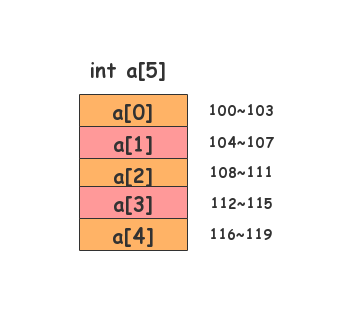
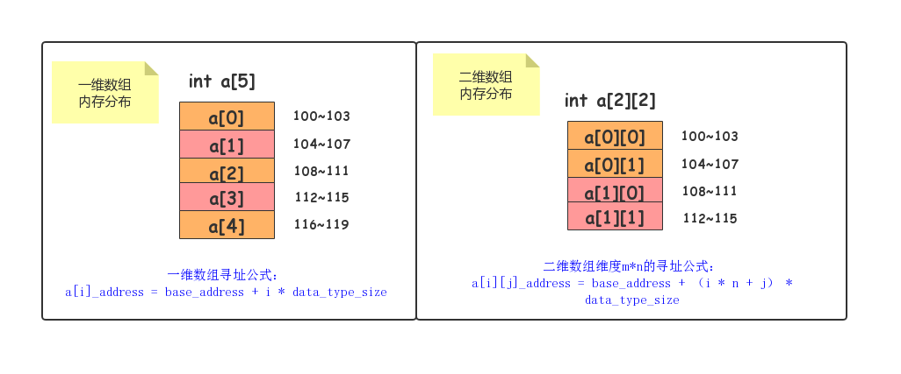
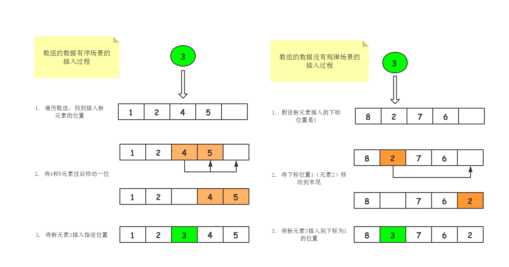

## 最基础的数据结构-数组

### 数组

提到数组，相信大家的都不陌生，毕竟每个编程语言都会有它的影子。

数组是最基础的数据结构，尽管数组看起来非常的基础简单，但这个基础的数据结构要掌握其精髓，也不是那么简单事。

### 开门见山
数组（Array）是一种线性表数据结构，它用一组连续的内存空间，来存储一组具有相同类型的数据。

这个定义有几个关键词，也是数组的精髓所在。下面就从这几个关键词进一步理解数组。

第一个是线性表。顾名思义，线性表的特征就是数据排成像一条线一样的结构。每个线性表的数据最多只有前和后两个方向。除了数组，链表、队列、栈等数据结构也是线性表结构。

举个栗子，糖葫芦串就与线性表的特征非常相似。糖葫芦（数据）串成在一条直线的竹签，并且每个糖葫芦（数据）最多只有前和后两个方向。

第二个是连续的内存空间和相同的类型的数据。因为这两个条件的限制，数组有了非常重要的特性：随机访问元素，随机访问元素的时间复杂度为O(1)。但有利必有弊，这两个条件的限制导致数据在进行插入和删除一个数据的时候，为了保证数据的连续性，就需要做数据的搬移操作。

### 随机访问
数组是如何实现根据下表随机访问数组元素的呢？

我们拿一个长度为5的int类型的数组int a[5]，来举例子。在我们定义这个数组时，计算机会给数组int a[5]，分配了一块连续的内存空间。



假设，数组int a[5]内存块的首地址为base_address=100，那么

a[0]的地址就是100（首地址）
a[2]的地址就是104
a[3]的地址就是108
a[3]的地址就是112
a[4]的地址就是116
计算机是通过访内存地址，来访问内存中存储的数据。那么，当计算机要随机访问数组中的某个元素时，会通过下面这条寻址公式，计算出对应元素的内存地址，从而通过内存地址访问数据。

```
a[i]_address = base_address + i * data_type_size
```

a[i]_address表示对应数组下标的内存地址，data_type_size表示数组存储的数据类型的大小，数组int a[5]。存储的是5个int类型的数据，它的data_type_size就为4个字节。

二维数组的寻址公式，假设二位数组的维度是m*n，则公式为：
```
a[i][j]_address = base_address + ( i * n + j ) * data_type_size
```



### 为什么数组下标从0开始?
要先解答这个问题时，我们试想假设数组下标从1开始，a[1]表示数组的首地址，那么计算机的寻址公式就会变成为：
```
a[i]_address = base_address + (i - 1) * data_type_size
```
对比数组下标从0开始和设数组下标从1开始的寻址公式，我们不难看出，从1开始编号，每次随机访问数组元素都多了一次减法运算，对于CPU来说，就是多了一次减法指令。

更何况数组是非常基础的数据结构，使用频率非常的高，所以效率优化必须要做到极致。所以为了减少CPU的一次减法指令，数组选择了从0开始编号，而不是从1开始。

以上是从计算机寻址公式角度分析的，当然其实还有历史等原因。

### 数组的插入和删除过程
前面提到对于数组的定义，数组为了保持内存数据的连续性，就会导致插入和删除这两个操作比比较低效。接下来通过代码来阐述为什么导致低效呢？又有哪些方法改进？

插入操作过程
插入操作对于数据的不同的场景和不同的插入位置，时间复杂度都略有不同。接下来以数组的数据是有序和没有规律的两种场景分析插入操作。

不管什么场景，如果在数组的末尾插入元素，那么就非常简单，不需要搬移数据，直接将元素放入到数组的末尾，这时空间复杂度就为O(1)。

如果在数组的开头或中间插入数据呢？这时可以根据场景的不同，采用不同的方式。

如果数组的数据是有序（从小到大或从大到小），在第k位置插入一个新的元素时，就必须把k之后的数据往后移动一位，此时最坏时间复杂度是O(n)。

如果数组的数据没有任何规律，那么在第k位置插入一个新的元素时，先将旧的第k位置的数据搬移到数据末尾，在把新的元素数据直接放入到第k位置。那么在这种特定场景下，在第k个位置插入一个元素的时间复杂度就为O(1)。

一图胜千言，我们以图的方式展现数组的数据是有序和没有规律场景的插入元素的过程。




### 删除操作过程
跟插入数据类似，如果我们要删除第k位置的数据，为了内存的连续性，也是需要数据搬移，不然中间就会出现空洞，内存就不连续了。

如果删除数组末尾的数据，则时间复杂度为O(1)；如果删除开头的数据，因需把k位置之后的数据往前搬移一位，那么时间复杂度就为O(n)。

一图胜千言，我们以图的方式展现数组删除操作。


---

总结：数组是最基础、最简单的数据结构。数组用一块连续的内存空间，来存储相同类型的一组数据，最大的特点就是随机访问元素，并且时间复杂度为O(1)。但是插入、删除操作也因此比较低效，时间复杂度为O(n)。

