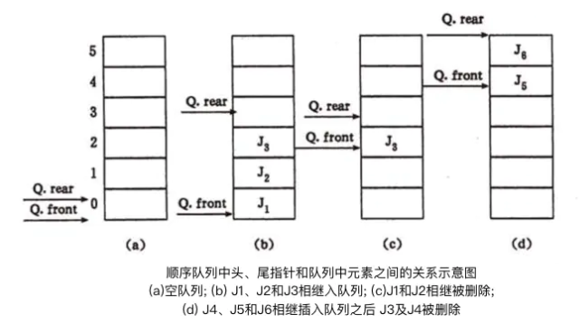

# 队列

> 本文主要讲解了队列的定义和队列主要功能实现的算法。最后会列举一些队列在程序设计当中常见的应用实例！

### 队列的定义
队列 (Queue)是一种先进先出(first in first out : FIFO)的线性表。它只允许在表的一端进行插入，在另一端进行删除元素。这和我们平时战队买票很一样。最早进入队列的元素最先离开，在队列中，允许插入的一端叫做队尾(rear),允许删除的一段则称为队头(front).示意图如下：


### 队列的分类

队列主要分为两类：
- 链式队列：链式队列即用链表实现的队列
- 顺序队列：顺序队列是用数组实现的队列，顺序队列通常必须是循环队列

顺序队列本身是一种数组表示。在队列的顺序存储结构中，除了用一组连续的存储单元依次存放从队列头到队列尾的元素之外，尚需附设两个指针 front 和 rear 分别指示队列头元素及队列尾元素的位置。为了在C语言中描述方便，通常有如下约定：初始化创建空队列时，令 front = rear = 0，每当插入新的队列尾元素时，“尾指针增 1”；每当删除队列头元素时，“头指针增 1”；因此，在非空队列下，头指针始终指向队列头元素，而尾指针始终指向队列尾元素的下一个位置，如图所示：



假设当前队列分配最大空间为6，则当队列处于上图(d)的状态时，不可再继续插入新的队尾元素，否则会因为数组越界而导致程序代码被破坏。然而此时又不宜进行存储再分配扩大数组空间，因为队列的实际可用空间并未占满。一个巧妙的办法是将顺序队列臆造为一个环状的空间，如图所示，称之为循环队列：


如图，指针和队列之间的关系不变，上图 (a) 所示循环队列中，队列头元素是 J3 ，队列尾元素是 J5,之后J6,J7和J8相继插入，则队列空间均被占满，如图 (b) 所示，此时 Q.front = Q.rear; 反之，若 J3,J4 和 J5 相继从图 (a) 队列中删除，使队列呈“空”的状态，如图 (c) 所示，此时存在关系为 Q.front = Q.rear, 由此可见只凭等式 Q.front = Q.rear无法判断队列是“空”还是“满”。有两种可处理方式：一种是另外设置一个标志以区别队列是 “空” 还是 “满”；另一种是少用一个元素空间，约定以“队列头指针在队列尾指针的下一位置(指环状的下一位置)”作为队列呈“满”状态的标志。

从此分析中可见，在C语言中不能用动态分配的一维数组来实现循环队列，如果用户的应用程序中设有循环队列，则必须为它设定一个最大队列长度，若用户无法预估所用队列的最大长度，则宜采用链式队列。

> front && rear 不同场合下含义不同。

- 队列初始化 -- front 和 rear 的值都是零
- 队列非空 -- front 代表队列的第一个元素，rear 代表队列的最后一个有效元素的下一个元素
- 队列为空 -- front 和 rear 相等，但不一定是零

###  入队伪算法

> 尾部入队，分两步完成

将值存入r所代表的位置
错误写法 r = r + 1; 正确写法： r = (r + 1) % 数组的长度 【n-1对n取余，结果就是n-1】

### 出队伪算法

> 头部出队，分两步完成

将f出队的值保存起来（可以根据具体需求确定是否要保存）
f 的指针变动正确写法： f = (f + 1) % 数组的长度 【n-1对n取余，结果就是n-1】

### 如何判断循环队列是否为空

> 如果front == rear ，则该队列一定为空

### 如何判断循环队列已满

预备知识：
front 的值可能比 rear 大
front 的值也可能比 rear 小
当然两者也完全可能相等

判断已满两种方式：

### 什么时候该使用顺序队列？什么时候该使用链式队列？
如果用户的应用程序中设有循环队列，则必须为它设定一个最大队列长度，若用户无法预估所用队列的最大长度，则宜采用链式队列

### 队列的伪算法和实现
此小节实现的是一个最大队列长度为 6 的环形队列，下面是本队列的定义和相关实现。

### 队列类型的定义

```
#define kQueueMaxLength 6   // 假设最大长度为 6
typedef struct Queue{
    int * pBase;    // 队列中操作的数组
    int front;      // 队头
    int rear;       // 对尾
}QUEUE;
```

### 队列的初始化

```
void init_queue(QUEUE *pQueue){
    pQueue->pBase = (int *)malloc(sizeof(int) * kQueueMaxLength); // 初始化，pBase指向长度6的 int* 数组
    pQueue->front = pQueue->rear = 0;
}
```

### 元素入队

```
/**
 入队

 @param pQueue 要入队的队列地址
 @param val 入队元素的值
 @return 入队成功/失败
 */
bool en_queue(QUEUE *pQueue , int val){
    
    if (full_queue(pQueue)) { // 队列已满，直接返回入队失败
        return false;
    }else
    {   // 队列未满，执行入队操作
        
        // 1.元素插入数组中
        pQueue->pBase[pQueue->rear] = val;
        // 2.队头队尾的表示
        pQueue->rear = (pQueue->rear + 1) % kQueueMaxLength;
        
        return true;
    }
}
```

### 元素出队

```
/**
 出队

 @param pQueue 要出队队列地址
 @param val 被出队元素地址
 @return 出队成功/失败
 */
bool de_queue(QUEUE *pQueue , int *val){
    
    if (empty_queue(pQueue)) {  // 如果是空队列，直接出队失败
        return false;
    }else
    {
        // 出队->保存被出队元素的值
        *val = pQueue->pBase[pQueue->front];
        // 修改队头位置
        pQueue->front = (pQueue->front + 1) % kQueueMaxLength;
        
    }
    return true;
}
```

### 遍历队列

```
/**
 遍历队列

 @param pQueue 要遍历的队列的地址
 */
void tranverce_queue(QUEUE *pQueue){
    
    int i = pQueue->front;
    int lenght = 0;
    while (i != pQueue->rear) {
        lenght ++;
        i = (i + 1) % kQueueMaxLength;
    }
    printf("队列中共有 %d 个元素\n",lenght);
    
    i = pQueue->front;
    while (i != pQueue->rear) {
        
        printf("第 %d 个元素为 %d\n",i + 1,pQueue->pBase[i]);
        i = (i + 1) % kQueueMaxLength;
    }
}
```

队列中元素先进先出 FIFO (first in, first out)的示意


## 学习视频

[栈和队列](https://www.youtube.com/watch?v=KaMUAVCf1Rc)

[为什么要学习消息队列](https://www.youtube.com/watch?v=KoccSL_56sM)

## 参考

- [Wikipedia](https://en.wikipedia.org/wiki/Queue_(abstract_data_type))
- [YouTube](https://www.youtube.com/watch?v=wjI1WNcIntg&list=PLLXdhg_r2hKA7DPDsunoDZ-Z769jWn4R8&index=3&)
