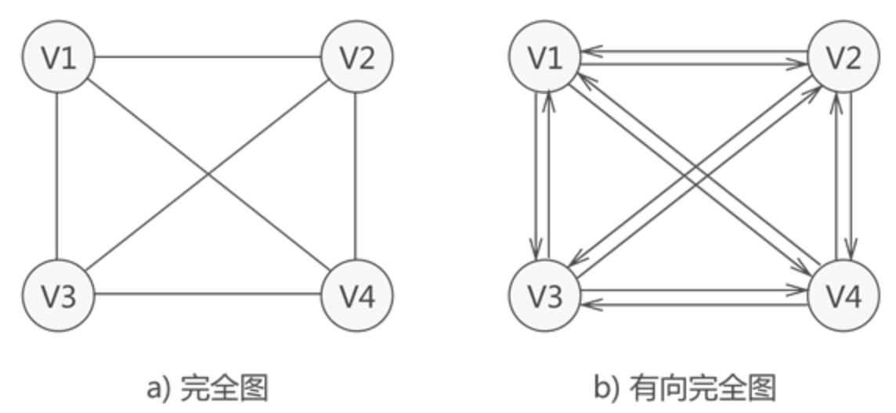

# 图

> 我们知道，数据之间的关系有 3 种，分别是 "一对一"、"一对多" 和 "多对多"，前两种关系的数据可分别用线性表和树结构存储，本节学习存储具有"多对多"逻辑关系数据的结构——图存储结构。

图 1 所示为存储 V1、V2、V3、V4 的图结构，从图中可以清楚的看出数据之间具有的"多对多"关系。例如，V1 与 V4 和 V2 建立着联系，V4 与 V1 和 V3 建立着联系，以此类推。

与链表不同，图中存储的各个数据元素被称为顶点（而不是节点）。拿图 1 来说，该图中含有 4 个顶点，分别为顶点 V1、V2、V3 和 V4。
图存储结构中，习惯上用 Vi 表示图中的顶点，且所有顶点构成的集合通常用 V 表示，如图 1 中顶点的集合为 V={V1,V2,V3,V4}。

注意，图 1 中的图仅是图存储结构的其中一种，数据之间 "多对多" 的关系还可能用如图 2 所示的图结构表示：

可以看到，各个顶点之间的关系并不是"双向"的。比如，V4 只与 V1 存在联系（从 V4 可直接找到 V1），而与 V3 没有直接联系；同样，V3 只与 V4 存在联系（从 V3 可直接找到 V4），而与 V1 没有直接联系，以此类推。

因此，图存储结构可细分两种表现类型，分别为无向图（图 1）和有向图（图 2）。

### 图的基本常识

#### 弧头和弧尾

有向图中，无箭头一端的顶点通常被称为"初始点"或"弧尾"，箭头直线的顶点被称为"终端点"或"弧头"。

#### 入度和出度

对于有向图中的一个顶点 V 来说，箭头指向 V 的弧的数量为 V 的入度（InDegree，记为 ID(V)）；箭头远离 V 的弧的数量为 V 的出度（OutDegree，记为OD(V)）。拿图 2 中的顶点 V1来说，该顶点的入度为 1，出度为 2（该顶点的度为 3）。

#### (V1,V2) 和 <V1,V2> 的区别

无向图中描述两顶点（V1 和 V2）之间的关系可以用 (V1,V2) 来表示，而有向图中描述从 V1 到 V2 的"单向"关系用 <V1,V2> 来表示。

---

由于图存储结构中顶点之间的关系是用线来表示的，因此 (V1,V2) 还可以用来表示无向图中连接 V1 和 V2 的线，又称为边；同样，<V1,V2> 也可用来表示有向图中从 V1 到 V2 带方向的线，又称为弧。

#### 集合 VR 的含义

并且，图中习惯用 VR 表示图中所有顶点之间关系的集合。例如，图 1 中无向图的集合 VR={(v1,v2),(v1,v4),(v1,v3),(v3,v4)}，图 2 中有向图的集合 VR={<v1,v2>,<v1,v3>,<v3,v4>,<v4,v1>}。

#### 路径和回路

无论是无向图还是有向图，从一个顶点到另一顶点途径的所有顶点组成的序列（包含这两个顶点），称为一条路径。如果路径中第一个顶点和最后一个顶点相同，则此路径称为"回路"（或"环"）。

并且，若路径中各顶点都不重复，此路径又被称为"简单路径"；同样，若回路中的顶点互不重复，此回路被称为"简单回路"（或简单环）。

拿图 1 来说，从 V1 存在一条路径还可以回到 V1，此路径为 {V1,V3,V4,V1}，这是一个回路（环），而且还是一个简单回路（简单环）。
>在有向图中，每条路径或回路都是有方向的。

#### 权和网的含义

在某些实际场景中，图中的每条边（或弧）会赋予一个实数来表示一定的含义，这种与边（或弧）相匹配的实数被称为"权"，而带权的图通常称为网。如图 3 所示，就是一个网结构：

子图：指的是由图中一部分顶点和边构成的图，称为原图的子图。

### 图存储结构的分类

根据不同的特征，图又可分为完全图，连通图、稀疏图和稠密图：

完全图：若图中各个顶点都与除自身外的其他顶点有关系，这样的无向图称为完全图（如图 4a)）。同时，满足此条件的有向图则称为有向完全图（图 4b)）。

>具有 n 个顶点的完全图，图中边的数量为 n(n-1)/2；而对于具有 n 个顶点的有向完全图，图中弧的数量为 n(n-1)。

稀疏图和稠密图：这两种图是相对存在的，即如果图中具有很少的边（或弧），此图就称为"稀疏图"；反之，则称此图为"稠密图"。

>稀疏和稠密的判断条件是：e<nlogn，其中 e 表示图中边（或弧）的数量，n 表示图中顶点的数量。如果式子成立，则为稀疏图；反之为稠密图。

### 学习视频

[数据结构-图的串讲](https://www.youtube.com/watch?v=W6vRz1yzCUM&t=106s)

## 参考

- [Wikipedia](https://en.wikipedia.org/wiki/Graph_(abstract_data_type))
- [Introduction to Graphs on YouTube](https://www.youtube.com/watch?v=gXgEDyodOJU&index=9&list=PLLXdhg_r2hKA7DPDsunoDZ-Z769jWn4R8)
- [Graphs representation on YouTube](https://www.youtube.com/watch?v=k1wraWzqtvQ&index=10&list=PLLXdhg_r2hKA7DPDsunoDZ-Z769jWn4R8)
